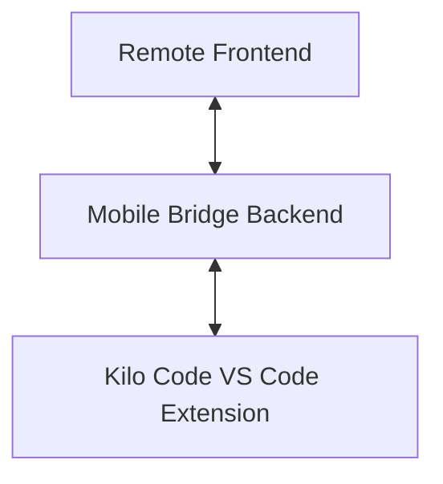
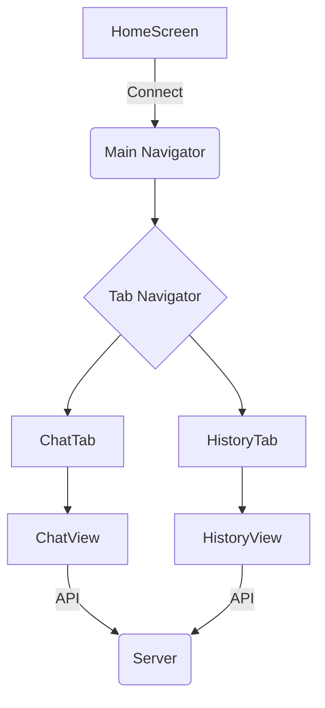

# Kilo Remote

This is a mobile application that serves as a remote client for a development assistance tool.

## Kilo Code Remote Concept

This document provides an overview of the Kilo Code Remote concept, which enables interaction with the Kilo Code VS Code extension from external clients, such as a mobile application.

### High-Level Overview

The Kilo Code Remote architecture consists of three main components:

1.  **Kilo Code VS Code Extension**: The core component that runs within VS Code and performs tasks.
2.  **Mobile Bridge Backend**: A server that acts as a bridge between the VS Code extension and external clients.
3.  **Remote Frontend**: A client application (e.g., a mobile app) that interacts with the user and communicates with the Mobile Bridge Backend.

The following diagram illustrates the high-level architecture:



### Backend Module

The Mobile Bridge Backend is an MobileBridge.ts server responsible for the following:

- Exposing a set of API endpoints for clients to interact with.
- Communicating with the Kilo Code VS Code extension to create and manage tasks.
- Streaming task progress and results back to the client using Server-Sent Events (SSE).

The backend is implemented in `apps/kilo-remote/MobileBridge.js` and provides the endpoints documented in `apps/kilo-remote/MOBILE_BRIDGE_API.md`.

### Frontend Module

The remote frontend is a React Native application located in `apps/kilo-remote`. It provides a user interface for:

- Starting new Kilo Code tasks.
- Viewing the progress and results of ongoing tasks.
- Interacting with tasks by sending follow-up messages.
- Viewing task history.

The frontend communicates with the Mobile Bridge Backend to perform these actions.

### Interaction Flow

The typical interaction flow is as follows:

1.  The user initiates a new task from the remote frontend.
2.  The frontend sends a `POST /new-task` request to the Mobile Bridge Backend.
3.  The backend creates a new task in the Kilo Code VS Code extension.
4.  The backend establishes an SSE connection with the frontend to stream task updates.
5.  The Kilo Code VS Code extension processes the task and sends updates to the backend.
6.  The backend forwards these updates to the frontend via the SSE stream.
7.  The user can send follow-up messages, which are sent to the backend via a `POST /send-followup` request and then forwarded to the VS Code extension.

This architecture allows for a seamless experience where a user can interact with Kilo Code from a remote device without needing direct access to the VS Code instance.

## Project Summary

### Purpose

This project is a mobile application, "Kilo Remote," built with React Native and Expo. It serves as a remote client for a development assistance tool. The app allows users to connect to a server, interact with an AI assistant through a chat interface, and manage a history of tasks.

### Architecture

The application is structured as follows:

- **`App.js`**: The main entry point of the application. It sets up the navigation structure using React Navigation, including a stack navigator and a bottom tab navigator. It also initializes the theme and font providers.

- **`src/`**: This directory contains the core application logic, organized into the following subdirectories:
    - **`components/`**: Contains all the React components that make up the UI.
        - **`HomeScreen.js`**: The initial screen where users enter the server URL to connect.
        - **`ChatView.js`**: The main chat interface where users interact with the AI assistant. It supports different "modes" that change the appearance and behavior of the chat.
        - **`HistoryView.js`**: Displays a list of past tasks, allowing users to view the chat history for each task.
        - Other components include UI elements like backgrounds, buttons, and message bubbles.
    - **`context/`**: Contains the `ThemeContext`, which manages the application's theme.
    - **`hooks/`**: Contains custom hooks, such as `useTheme`.
    - **`services/`**: Contains the API client for communicating with the server. It includes functions for starting new tasks, sending follow-up messages, and fetching task history.
    - **`styles/`**: Contains the application's styling, including theme definitions and component-specific styles.
    - **`utils/`**: Contains utility functions.

### Key Features

- **Remote Connection**: The app connects to a remote server to access the AI assistant's functionality.
- **Chat Interface**: A real-time chat interface for interacting with the AI assistant.
- **Task Management**: The app organizes conversations into tasks, and users can view the history of past tasks.
- **Modes**: The chat interface supports different modes, which can be changed by the user or the AI assistant. Each mode has a unique background and font.
- **Theming**: The app has a theming system that allows for a consistent look and feel.

### Diagram



## Prerequisites

Before you begin, ensure you have the following software installed on your system:

- **Node.js** (LTS version recommended)
- **npm** or **Yarn**
- **Watchman** (for macOS): `brew install watchman`
- **Xcode** and **Xcode Command Line Tools** (for iOS development)
- **ios-deploy** (for deploying to physical iOS devices): `npm install -g ios-deploy`

## Development Setup

This project uses a script-based approach for consistency across platforms.

### Environment Variables

To connect to your specific Kilo Remote server, you'll need to provide its URL.

1.  Create a new file named `.env` in the `apps/kilo-remote` directory by copying the `.env.example` file.
2.  In the `.env` file, add the following line, replacing the URL with your server's address:

    ```
    EXPO_PUBLIC_DEFAULT_WORKSPACE_URL=http://your-server-url:3000
    ```

    _(Note: The `EXPO_PUBLIC_` prefix is mandatory for variables to be accessible in the Expo client app.)_

The `.env` file is ignored by Git, so your URL will remain private.

### Web Development

**1. Clean & Install**
Resets your project dependencies. Run this if you encounter issues with packages.

```bash
sh scripts/web/clean-install.sh
```

**2. Develop**
Starts the Expo development server for the web with live reloading.

```bash
sh scripts/web/develop.sh
```

**3. Deploy Standalone**
Builds the static web app for production. The output will be generated in the `dist/` directory.

```bash
sh scripts/web/deploy-standalone.sh
```

### iOS Development

**1. Clean & Install**
A comprehensive script that cleans all dependencies (`node_modules`, `Pods`) and prepares the native iOS project. Run this when starting fresh or encountering build issues.

```bash
sh scripts/ios/clean-install.sh
```

**2. Develop**
Launches the app on a simulator or a wirelessly connected device with live reloading enabled.
**Usage:**

```bash
sh scripts/ios/develop.sh [simulator|device] [Device/Simulator Name]
```

**Examples:**

```bash
# Run on the "iPhone 15 Pro" simulator
sh scripts/ios/develop.sh simulator "iPhone 15 Pro"

# Run on your wirelessly connected iPhone
sh scripts/ios/develop.sh device "My iPhone"
```

**3. Deploy Standalone**
Builds a final, standalone release version (`.ipa`) and installs it on your USB-connected device. It's highly recommended to run the `clean-install.sh` script before this to ensure a pristine build.
**Usage:**

```bash
sh scripts/ios/deploy-standalone.sh "My iPhone"
```

## Mock Server

The project includes a mock server for development and testing purposes. The mock server provides mock data for the app, including tasks, messages, and modes.

To start the mock server, run the following command:

```bash
node mock-server.js
```

The mock server will start on port 3000.
